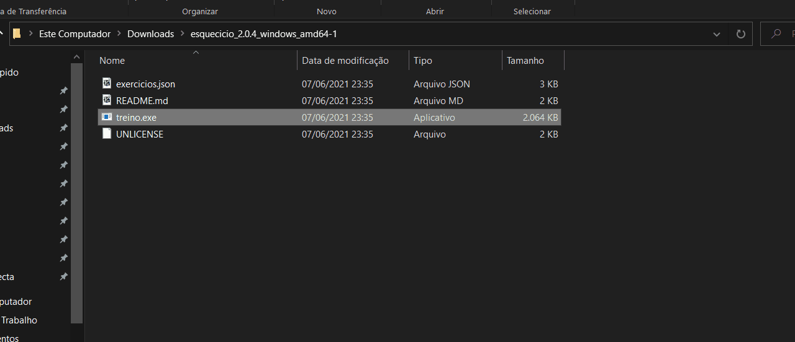

# Esquecicio

Gerador de circuito de treino com base na separação de exercícios em push ("ombros", "peito" e "tríceps"), pull ("bíceps" e "costas"), legs (pernas) e abs (abdômen)

> DISCLAIMER: Não possuo formação na área de saúde, portanto **NÃO** recomendo essa separação e muito menos os exercícios de exemplo do funcionamento da ferramenta. Consulte um profissional que entenda suas necessidades e limitações.

## Utilização



1. Baixe o [executável](https://github.com/nenitf/esquecicio/releases)
2. Edite o arquivo `exercicios.json` com a configuração pretendida
3. Execute o binário

## Configuração

- `semana`: tipos de treinos vão ser feitos em que dias da semana
- `exercícios`: separação dos treinos (push, pull, legs, abs)
    - Cada exercício possui `nome`, `dificuldade` e `grupo`

## Desenvolvimento

### Run

```sh
go run ./cmd/main.go
```

### Testes

```sh
go test ./pkg/esquecicio/usecase
```

## Referências

- [Como Começar na Calistenia - Guia Prático](https://bookdown.org/kaiquegalois/guia_pratico/como-organizar-seus-treinos.html#intermedi%C3%A1rio---push-pull)
